# e-commerce-backend
Challenge 13 for UTA bootcamp- e-commerce-backend

This is a backend e-commerce website that uses the latest technologies so that companies can compete with other e-commerce companies. 

## Table of Contents  
  * [Featuers](#features)
  * [Usage](#usage)
  * [Screenshots](#screenshots)
  * [Credits](#credits)

## Features
Using Express.js API, MySQL, Sequelize, Dotenv & Insomnia

## Usage
This will be used through node.js for backend viewing and Insomnia for testing 

### Video Link inserted here:
https://drive.google.com/file/d/133Rq2iE2GHxI81o6n_xvFOOp4pazFtFo/view

## Screenshots
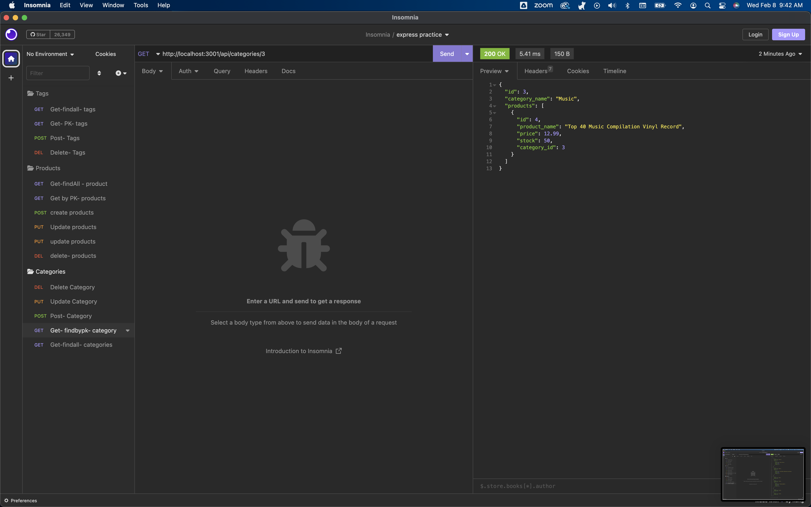

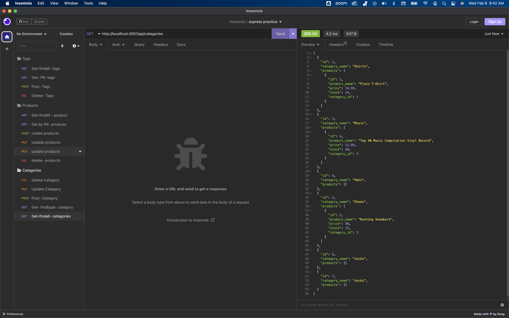

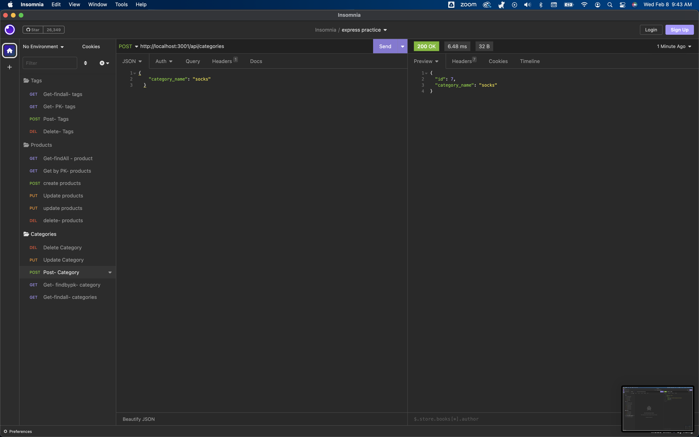

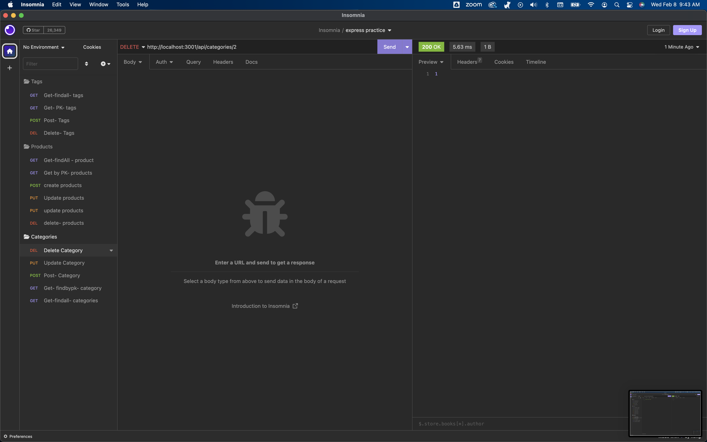

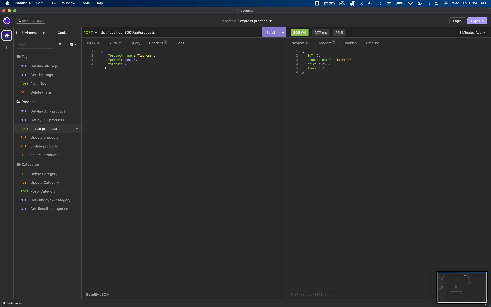

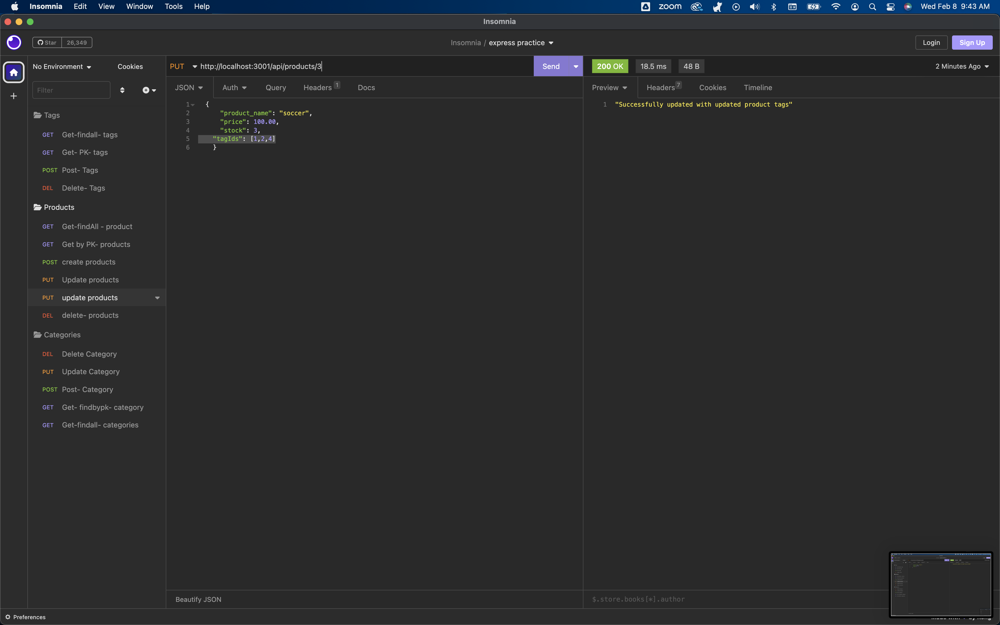

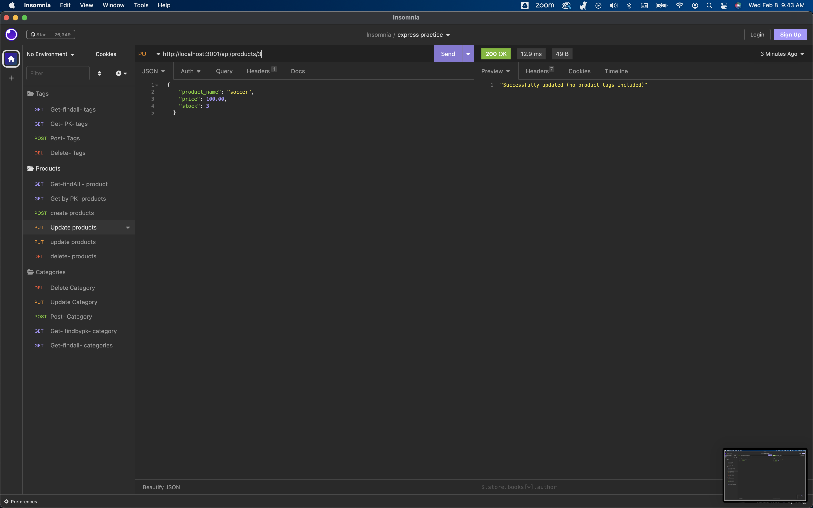

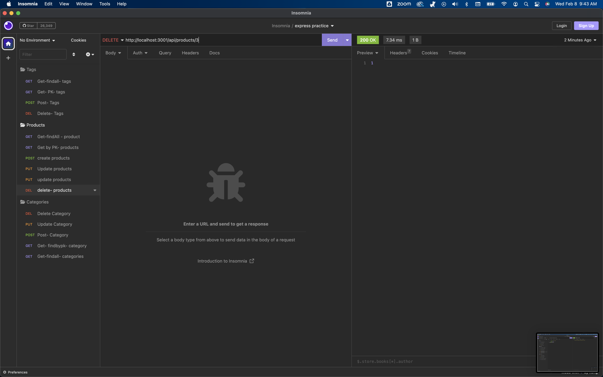

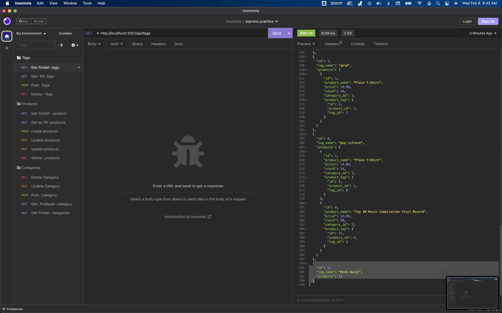

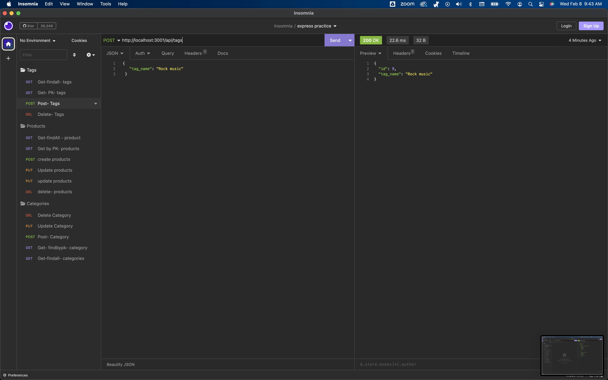

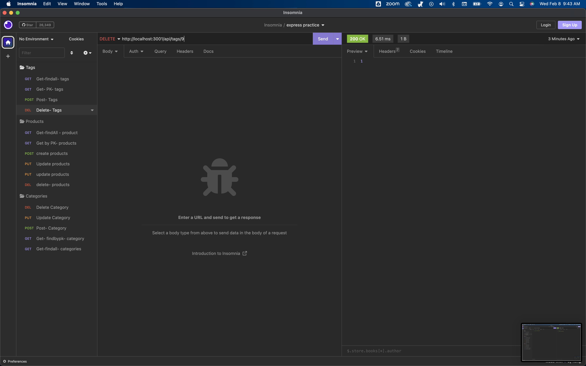

## Credits
https://www.npmjs.com/package/inquirer#questions

https://developer.mozilla.org/

https://stackoverflow.com/questions/36856232/write-add-data-in-json-file-using-node-js

https://www.npmjs.com/

Erin Peifer - https://github.com/Airen22

Chris Zavala- https://github.com/ChrisZavala

Myeonghun Jeong- https://github.com/mjtic

UTA Tutors- THEY ARE ROCKSTARS! - Meg Meyes FTW

## Authors

Karen Peazooni Github

## License
MIT License
A short and simple permissive license with conditions only requiring preservation of copyright and license notices. Licensed works, modifications, and larger works may be distributed under different terms and without source code.

Copyright (c) 2012-2022 Scott Chacon and others

Permission is hereby granted, free of charge, to any person obtaining
a copy of this software and associated documentation files (the
"Software"), to deal in the Software without restriction, including
without limitation the rights to use, copy, modify, merge, publish,
distribute, sublicense, and/or sell copies of the Software, and to
permit persons to whom the Software is furnished to do so, subject to
the following conditions:

The above copyright notice and this permission notice shall be
included in all copies or substantial portions of the Software.

THE SOFTWARE IS PROVIDED "AS IS", WITHOUT WARRANTY OF ANY KIND,
EXPRESS OR IMPLIED, INCLUDING BUT NOT LIMITED TO THE WARRANTIES OF
MERCHANTABILITY, FITNESS FOR A PARTICULAR PURPOSE AND
NONINFRINGEMENT. IN NO EVENT SHALL THE AUTHORS OR COPYRIGHT HOLDERS BE
LIABLE FOR ANY CLAIM, DAMAGES OR OTHER LIABILITY, WHETHER IN AN ACTION
OF CONTRACT, TORT OR OTHERWISE, ARISING FROM, OUT OF OR IN CONNECTION
WITH THE SOFTWARE OR THE USE OR OTHER DEALINGS IN THE SOFTWARE.

Acknowledgments
W3Schools
Stack OverFlow